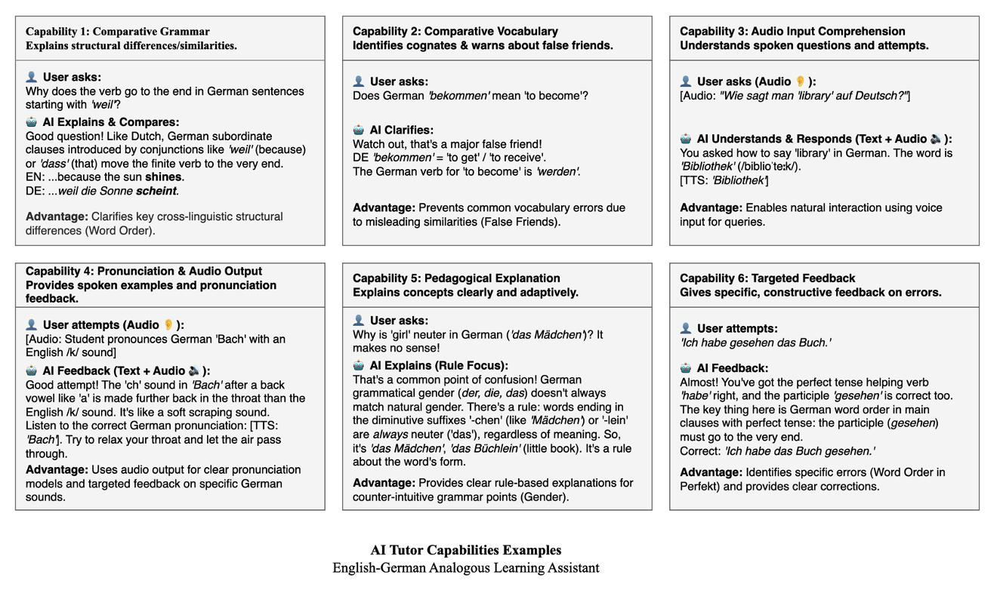
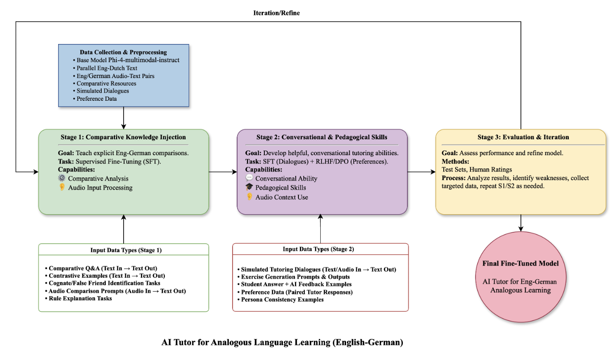

# AI Tutor - Cross-Linguistic Language Learning Training Framework

A comprehensive training framework for building an English-German cross-linguistic AI tutoring system based on the Phi-4 multimodal model.

## 📝 Project Overview

This project implements the AI tutoring system described in the paper "*Evaluating an AI Model for Cross-Linguistic Language Learning: A Randomized Controlled Trial*". The system uses contrastive pedagogy to help Chinese native speakers learn both English and German simultaneously, featuring six core capabilities:



1. **Comparative Grammar Analysis** - Detailed comparison of English-German grammatical differences
2. **Comparative Vocabulary Analysis** - Identification of false friends and cognates
3. **Audio Input Comprehension** - Processing of speech input
4. **Pronunciation & Audio Output** - Pronunciation guidance and feedback
5. **Pedagogical Explanation** - Clear rule explanations adapted to learner level
6. **Targeted Feedback** - Personalized error correction and suggestions

## 🏗️ Training Framework

The training framework follows a structured multi-stage approach as illustrated below:



The framework consists of three main stages:
- **Stage 1: Comparative Knowledge Injection** - Supervised Fine-Tuning (SFT) to instill cross-linguistic knowledge
- **Stage 2: Conversational & Pedagogical Skills** - SFT + RLHF to develop tutoring abilities
- **Stage 3: Evaluation & Iteration** - Comprehensive testing and refinement

## 🚀 Quick Start

### Environment Setup

```bash
# Create virtual environment
conda create -n ai_tutor python=3.9
conda activate ai_tutor

# Install dependencies
pip install -r requirements.txt

# For GPU support, install the appropriate PyTorch version
# pip install torch torchvision torchaudio --index-url https://download.pytorch.org/whl/cu118
```

### Quick Training

```bash
# Run the complete training pipeline
python scripts/train_full_pipeline.py --config config/training_config.yaml
```

### Step-by-Step Execution

```bash
# 1. Data Preparation
python scripts/prepare_data.py --output_dir ./data

# 2. SFT Training
python -m src.training.sft_trainer --config config/training_config.yaml \
    --train_data ./data/processed/train.json \
    --eval_data ./data/processed/validation.json

# 3. RLHF Training
python -m src.training.rlhf_trainer --sft_model ./models/sft_model \
    --config config/training_config.yaml \
    --data ./data/processed/preferences.json

# 4. Model Evaluation
python scripts/evaluate_model.py --model ./models/final_model \
    --benchmark ./data/benchmark/crosslinguistic_benchmark.json
```

## 📁 Project Structure

```
ai_tutor_training/
├── config/                     # Configuration files
│   ├── training_config.yaml   # Training configuration
│   └── model_config.yaml      # Model configuration
├── src/                        # Source code
│   ├── data_processing/        # Data processing modules
│   │   ├── data_collector.py   # Data collection
│   │   ├── preprocessor.py     # Data preprocessing
│   │   └── dataset_builder.py  # Dataset construction
│   ├── training/               # Training modules
│   │   ├── sft_trainer.py      # SFT trainer
│   │   ├── rlhf_trainer.py     # RLHF trainer
│   │   └── utils.py            # Training utilities
│   └── evaluation/             # Evaluation modules
│       ├── metrics.py          # Evaluation metrics
│       └── evaluator.py        # Evaluator
├── scripts/                    # Script files
│   ├── train_full_pipeline.py  # Complete training pipeline
│   ├── prepare_data.py         # Data preparation script
│   └── evaluate_model.py       # Model evaluation script
├── source/                     # Documentation assets
│   ├── framework.png           # Training framework diagram
│   └── abilities.png           # AI capabilities diagram
├── data/                       # Data directory
├── models/                     # Models directory
├── results/                    # Results directory
├── requirements.txt            # Dependencies list
└── README.md                   # Project documentation
```

## 🔧 Configuration

### Training Configuration (config/training_config.yaml)

Key configuration parameters:

- `model_name`: Base model name
- `output_dir`: Model output directory
- `sft`: SFT training parameters
- `rlhf`: RLHF training parameters
- `data`: Data path configuration
- `hardware`: Hardware configuration

### Model Configuration (config/model_config.yaml)

Key configuration parameters:

- `base_model`: Base model settings
- `tokenizer`: Tokenizer configuration
- `lora`: LoRA fine-tuning parameters
- `quantization`: Quantization settings
- `generation`: Generation parameters

## 📊 Data Formats

### Training Data Format

```json
{
  "text": "[COMPARE] [GRAMMAR] Compare the usage of present perfect tense in English and German...",
  "type": "grammar_comparison",
  "metadata": {
    "id": "grammar_001",
    "difficulty": "intermediate"
  }
}
```

### Benchmark Data Format

```json
{
  "id": "test_001",
  "prompt": "[COMPARE] [GRAMMAR] Explain the German V2 (verb-second) rule",
  "type": "grammar_comparison",
  "expected": {
    "key_points": ["verb position", "subject position"],
    "examples": ["Heute gehe ich..."]
  }
}
```

## 🎯 Usage Examples

### Basic Usage

```python
from transformers import AutoModelForCausalLM, AutoTokenizer

# Load model
model = AutoModelForCausalLM.from_pretrained("./models/final_model")
tokenizer = AutoTokenizer.from_pretrained("./models/final_model")

# Grammar comparison
prompt = "[COMPARE] [GRAMMAR] Compare the usage of present perfect tense in English and German."
inputs = tokenizer(prompt, return_tensors="pt")
outputs = model.generate(**inputs, max_new_tokens=256)
response = tokenizer.decode(outputs[0], skip_special_tokens=True)
print(response)
```

### Vocabulary Analysis

```python
prompt = "[VOCAB] Explain the difference between 'become' and 'bekommen'."
# ... same generation process as above
```

### Error Feedback

```python
prompt = "[FEEDBACK] A student wrote: 'Ich habe nach Hause gefahren.' Is this sentence correct?"
# ... same generation process as above
```

## 📈 Evaluation Metrics

The system provides multi-dimensional evaluation metrics:

### Basic Metrics
- BLEU Score
- ROUGE Score
- BERTScore

### Content Quality Metrics
- Comparison content coverage
- Explanation quality
- Example provision rate
- Response completeness

### Task-Specific Metrics
- Grammar terminology coverage
- False friend identification accuracy
- Error correction quality

### Performance Metrics
- Response speed
- Memory usage
- Throughput

## 🛠️ Advanced Features

### Custom Dataset

```python
from src.data_processing import CrossLinguisticDataCollector

collector = CrossLinguisticDataCollector()
# Add custom grammar rules
collector.data_sources['grammar_comparisons'].append({
    "topic": "Custom Grammar Point",
    "english_rule": "English rule",
    "german_rule": "German rule",
    # ... other fields
})
```

### Model Fine-tuning

```python
from src.training import CrossLinguisticSFTTrainer

trainer = CrossLinguisticSFTTrainer("config/training_config.yaml")
trainer.setup_model_and_tokenizer()
trainer.setup_lora()
# ... training process
```

### Evaluation Analysis

```python
from src.evaluation import CrossLinguisticEvaluator

evaluator = CrossLinguisticEvaluator("./models/final_model")
results = evaluator.evaluate_on_benchmark("./data/benchmark.json")
print(f"Overall Score: {results['overall_metrics']['overall_score']:.4f}")
```

## 🎛️ Command Line Tools

### Complete Training Pipeline

```bash
python scripts/train_full_pipeline.py \
    --config config/training_config.yaml \
    --experiment_name my_experiment \
    --output_dir ./experiments
```

### Data Preparation

```bash
python scripts/prepare_data.py \
    --output_dir ./data \
    --balance_dataset \
    --augment_data
```

### Model Evaluation

```bash
python scripts/evaluate_model.py \
    --model ./models/final_model \
    --benchmark ./data/benchmark.json \
    --output_dir ./evaluation_results \
    --capability_eval \
    --robustness_eval
```

### Interactive Evaluation

```bash
python scripts/evaluate_model.py \
    --model ./models/final_model \
    --benchmark ./data/benchmark.json \
    --interactive_eval
```

## 📋 Training Checklist

Before starting training, please confirm:

- [ ] All dependencies are installed
- [ ] Sufficient GPU memory (16GB+ recommended)
- [ ] Configuration file paths are correct
- [ ] Dataset is prepared
- [ ] Wandb login (if using)

## 🔍 Troubleshooting

### Common Issues

**1. CUDA Out of Memory**
```bash
# Use 4-bit quantization
# Set in model_config.yaml
quantization:
  load_in_4bit: true

# Or reduce batch size
batch_size: 2
```

**2. Model Loading Failed**
```bash
# Check model path
ls -la ./models/

# Check permissions
chmod -R 755 ./models/
```

**3. Data Format Error**
```python
# Validate data format
import json
with open('./data/processed/train.json', 'r') as f:
    data = json.load(f)
    print(f"Data count: {len(data)}")
    print(f"Example: {data[0]}")
```

### Performance Optimization Tips

1. **Use LoRA fine-tuning** to reduce memory usage
2. **Enable gradient checkpointing** to save memory
3. **Use fp16 precision** to accelerate training
4. **Appropriate batch size** to balance speed and memory

## 📚 Related Resources

- [Phi-4 Model Documentation](https://huggingface.co/microsoft/Phi-4-multimodal-instruct)
- [Transformers Library Documentation](https://huggingface.co/docs/transformers)
- [PEFT Library Documentation](https://huggingface.co/docs/peft)
- [TRL Library Documentation](https://huggingface.co/docs/trl)

## 🤝 Contributing

We welcome contributions! Please follow these steps:

1. Fork the project
2. Create a feature branch
3. Commit your changes
4. Push to the branch
5. Create a Pull Request

## 📄 License

This project is licensed under the MIT License. See the [LICENSE](LICENSE) file for details.

## 📞 Contact

For questions or suggestions, please contact:

- Email: your.email@example.com
- Project Homepage: https://github.com/your-username/ai-tutor-training

## 🙏 Acknowledgments

Thanks to the following projects and resources:

- Microsoft Phi-4 Team
- Hugging Face Community
- PyTorch Team
- All contributors

## 🔖 Citation

If this project helps your research, please cite:

```bibtex
@misc{ai_tutor_2024,
  title={AI Tutor for Cross-Linguistic Language Learning: Training Framework},
  author={Your Name},
  year={2024},
  publisher={Your Institution},
  url={https://github.com/your-username/ai-tutor-training}
}
```

---

**Start your AI tutoring system training journey!** 🚀